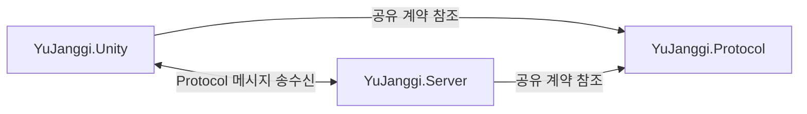
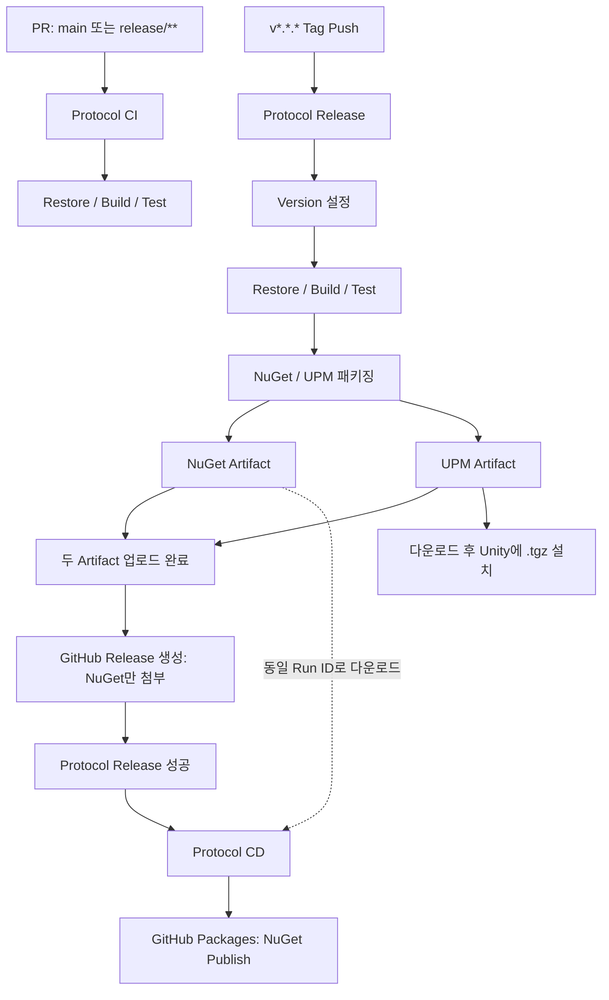

# YuJanggi.Protocol

`YuJanggi.Unity`와 `YuJanggi.Server`가 공유하는 네트워크 메시지 계약 라이브러리입니다. 요청·응답·이벤트의 형식과 JSON 직렬화, 패킷 길이 처리를 한 소스에서 관리하고 NuGet과 Unity UPM 패키지로 제공합니다.

- **공유 계약**: Connection / Matching / InGame 메시지와 `RequestId` 규칙
- **두 플랫폼 패키징**: 동일 소스를 .NET 라이브러리와 Unity용 소스 패키지로 생성
- **CI/CD**: PR 검증, Tag 기반 패키징, 검증한 NuGet Artifact의 GitHub Packages Publish

## 역할과 전체 구조

Client와 Server가 각각 Protocol을 참조해 동일한 메시지 형식을 사용합니다. 실제 연결·송수신, 매칭 판단, 게임 상태 변경은 소비 프로젝트에서 처리합니다.



핵심 기술은 C# 9, .NET 10 / .NET Standard 2.1, System.Text.Json, UPM, MSTest, GitHub Actions입니다.

## 주요 구조와 메시지

| 영역 | 대표 메시지와 역할 |
| --- | --- |
| [Connection](src/Connection) | `ProtocolHandshakeRequest` / `ProtocolHandshakeResponse`: 버전 호환 확인에 사용하는 데이터와 결과 |
| [Matching](src/Matching) | `MatchingStartRequest` / `MatchingStartResponse`, `MatchingCancelRequest` / `MatchingCancelResponse`: 매칭 시작·취소 요청과 처리 결과 |
| Matching | `MatchingFoundEvent`: 매치 ID·자신의 진영·상대 정보, `FormationSubmit`: 포진 제출, `GameReadyEvent`: 확정된 초·한 포진 |
| [InGame](src/InGame) | `GameSceneReady` / `GameStartEvent`: 씬 준비와 게임 시작, `MovePieceRequest` / `MovePieceResponse` / `MovePieceEvent`: 이동 요청·결과·이벤트 |
| InGame | `GameEndRequest` / `GameEndResponse` / `GameEndedEvent`: 종료 요청·처리 결과·최종 승자와 수순 정보 |

[`ClientMessage`와 `ServerMessage`](src/Messages)는 `Type`, `RequestId`, `Payload`를 담는 공통 메시지입니다. `GetPayload<T>()`로 구체적인 메시지 데이터를 추출합니다.

`ClientMessageFactory.CreateRequest`는 요청 ID를 생성하고, `ServerMessageFactory.CreateResponse`는 같은 ID를 응답에 유지합니다. `CreateEvent`로 생성한 서버 이벤트에는 요청 ID가 없습니다. 요청 대기와 응답 연결 처리는 Client / Server의 책임입니다.

모든 Client 메시지가 요청·응답 쌍은 아닙니다. `GameSceneReady`는 `ClientMessageFactory.Create`로 요청 ID 없이 생성하는 준비 알림이며, 게임 시작은 별도의 `GameStartEvent`로 전달합니다.

## Packet / Serialization

```text
ClientMessage / ServerMessage
→ MessageSerializer: UTF-8 JSON 바이트
→ MessageFramer: 4바이트 길이 헤더 + JSON 본문
→ Client / Server의 Network Transport
```

[`MessageSerializer`](src/Serialization/MessageSerializer.cs)는 System.Text.Json으로 직렬화·역직렬화합니다. [`MessageFramer`](src/Framing/MessageFramer.cs)는 본문 길이를 4바이트 Big-Endian 정수로 기록하고, 본문 크기를 1~4,096바이트로 제한합니다.

수신 측 Transport가 헤더와 본문을 읽으면 `DecodeBodyLength`로 길이를 확인하고 `Deserialize<T>()`로 메시지를 복원합니다. Protocol은 Socket이나 Receive loop를 구현하지 않습니다.

## 패키지 구성

| 패키지 | 구성 | 제공 위치 |
| --- | --- | --- |
| NuGet `YuJanggi.Protocol` | `net10.0` / `netstandard2.1` 라이브러리 | GitHub Packages, GitHub Release, Actions Artifact |
| UPM `com.seokjinyoo.yujanggi.protocol` | `package.json`, Runtime 소스, Assembly Definition, `.meta`를 포함한 `.tgz` | Actions Artifact |

[`SetVersion.ps1`](scripts/SetVersion.ps1)은 하나의 버전을 `src/Version.cs`, `.csproj`의 `<Version>`, `upm/package.json`에 적용합니다. [`BuildPackage.bat`](scripts/BuildPackage.bat)은 NuGet을 생성한 뒤 UPM을 준비하고 압축합니다.

[`Prepare-Upm.ps1`](scripts/Prepare-Upm.ps1)은 프로젝트의 실제 Compile Item을 조회해 `upm/Runtime/Generated`에 소스를 복사합니다. 생성물은 원본 `src/`에서 재생성하며, 패키지 이름과 상대 경로를 기준으로 고정 GUID의 `.meta`를 생성합니다.

UPM은 현재 Registry에 Publish하지 않습니다. Release 실행 화면의 **Artifacts → `yujanggi-protocol-upm`**에서 다운로드한 압축 파일을 풀고, Unity Package Manager의 **Install package from tarball**로 내부 `.tgz`를 설치합니다. 패키지 설정은 Unity 6000.0을 기준으로 하며, 소비 Unity 프로젝트가 System.Text.Json 8.0.5와 관련 의존성을 제공해야 합니다.

## CI/CD

[`workflowConfig.json`](workflowConfig.json)에서 Target, 솔루션 경로, .NET / Node.js 버전, Artifact 이름을 관리합니다. 현재 .NET SDK는 `10.0.x`, Node.js는 `22`입니다. 각 Workflow가 [`Read-WorkflowConfig.ps1`](scripts/Read-WorkflowConfig.ps1)을 통해 같은 설정을 읽습니다.

### Protocol CI — PR 검증

[`ci.yml`](.github/workflows/ci.yml)은 대상 브랜치가 `main` 또는 `release/**`인 Pull Request에서 실행합니다.

```text
Pull Request → Restore → Build (Release) → Test
```

Ubuntu Runner에서 솔루션을 검증합니다. Build는 `--no-restore`, Test는 `--no-build`로 앞 단계 결과를 사용하며, 패키징이나 Publish는 수행하지 않습니다.

### Protocol Release — 패키징과 GitHub Release

[`package-release.yml`](.github/workflows/package-release.yml)은 `v*.*.*` Tag Push에서 Windows Runner로 실행합니다.

```text
Tag → Version 설정 → Restore → Build → Test
→ NuGet 생성 → UPM 소스 생성 → npm pack
→ NuGet / UPM Artifact 업로드 → GitHub Release 생성
```

Tag의 `v`를 제외한 버전을 `SetVersion.ps1`에 전달해 두 패키지의 버전을 맞춥니다. 테스트가 실패하면 이후 패키징·업로드 단계는 진행하지 않습니다.

| 결과물 | Runner 출력 경로 | Actions Artifact | GitHub Release 첨부 |
| --- | --- | --- | --- |
| NuGet `.nupkg` | `artifacts/nuget/*.nupkg` | `yujanggi-protocol-nuget` | NuGet 출력 파일 첨부 |
| UPM `.tgz` | `artifacts/upm/*.tgz` | `yujanggi-protocol-upm` | 첨부하지 않음 |

UPM 압축은 저장소 루트에서 `npm pack ./upm --pack-destination ./artifacts/upm`으로 수행합니다. GitHub Release는 Tag를 제목으로 사용하고 Release Note를 자동 생성합니다.

Version 수정과 Runtime 소스 생성은 Runner 작업 공간에서 이루어집니다. Workflow가 이 결과를 저장소에 커밋하지 않으므로, 로컬 `upm/`이나 Tag가 가리키는 파일을 자동으로 갱신하지 않습니다. 현재 Unity 배포 결과물은 Artifact의 `.tgz`입니다.

### Protocol CD — NuGet Publish

[`cd.yml`](.github/workflows/cd.yml)은 `Protocol Release` 완료 시 `workflow_run`으로 실행하며, **성공한 Push 실행이고 동일 Repository인 경우**에만 Publish합니다.

```text
Protocol Release 성공
→ 해당 실행의 Commit에서 설정 조회
→ workflow_run.id로 NuGet Artifact 다운로드
→ GITHUB_TOKEN 인증 → GitHub Packages Publish
```

CD는 Release가 생성하고 검증한 `.nupkg`를 그대로 사용합니다. Version 설정, Restore, Build, Test, Pack을 다시 수행하지 않으며 UPM Artifact도 처리하지 않습니다.

Registry는 `https://nuget.pkg.github.com/<repository_owner>/index.json`입니다. 별도 PAT 없이 `GITHUB_TOKEN`을 사용하고, `contents: read`, `actions: read`, `packages: write` 권한으로 설정 조회·Artifact 다운로드·Publish를 수행합니다. `dotnet nuget push --skip-duplicate`로 이미 존재하는 버전은 건너뜁니다.

### 전체 자동화 흐름



## 테스트

[`YuJanggi.Protocol.Tests`](YuJanggi.Protocol.Tests)는 .NET 10 / MSTest 4.0.2로 다음 계약을 검증합니다.

- Handshake와 매칭 메시지의 직렬화·Framing·역직렬화 왕복
- 요청·응답의 `RequestId` 유지와 이벤트의 요청 ID 부재
- `GameSceneReady`의 요청 ID 부재와 Payload 보존
- 매칭 참가자 정보, GameReady의 포진 값과 메시지 타입 값 보존
- 빈 본문·최대 크기 초과·잘못된 헤더 크기 거부

서버 매칭 정책이나 게임 규칙을 검증하는 테스트는 이 저장소의 책임이 아닙니다.

## 프로젝트 구조

```text
YuJanggi.Protocol/
├─ src/                       # 메시지 계약, JSON 직렬화, Framing, 버전
│  ├─ Connection/
│  ├─ Matching/
│  ├─ InGame/
│  ├─ Messages/
│  ├─ Serialization/
│  └─ Framing/
├─ upm/                       # Unity 패키지 설정과 Runtime 구성
├─ scripts/                   # 버전 갱신, NuGet / UPM 패키징, 설정 조회
├─ YuJanggi.Protocol.Tests/    # MSTest 계약 검증
├─ .github/workflows/         # CI / Release / CD
├─ workflowConfig.json        # Workflow 공통 설정
└─ YuJanggi.Protocol.slnx      # 라이브러리와 테스트 솔루션
```

`artifacts/nuget`와 `artifacts/upm`은 패키징 실행 시 생성되는 출력 경로입니다. 로컬 패키징 진입점은 `scripts/LocalPackage.bat`이며, 사용자에게 Target / Version을 입력받아 버전 갱신과 패키징을 순서대로 실행합니다.

## 관련 프로젝트

- **YuJanggi.Unity**: Protocol을 사용해 요청을 보내고 서버 응답·이벤트를 처리하는 게임 Client
- **YuJanggi.Server**: Protocol 메시지를 받아 연결·매칭·게임 유스케이스를 처리하는 Server
- **YuJanggi.Engine**: 장기 규칙과 게임 진행을 담당하는 별도 라이브러리
